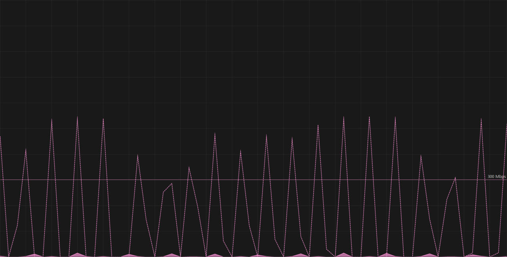
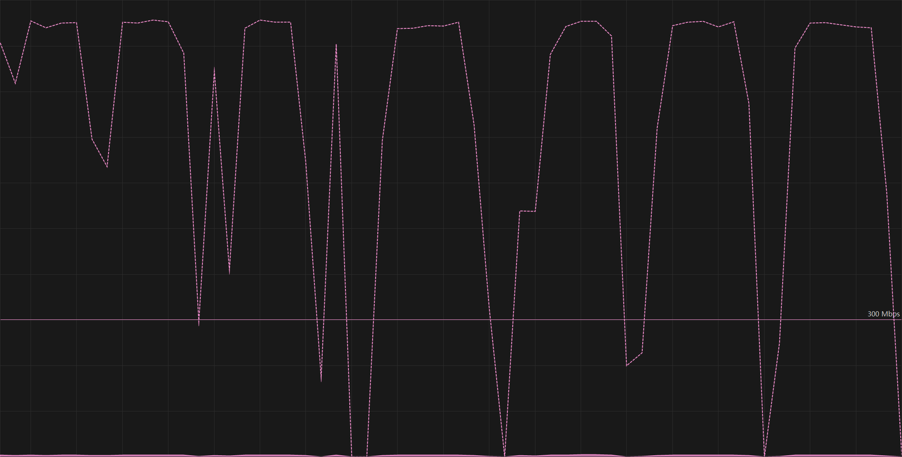

# reccli-ts

reccli-ts 是一个基于 TypeScript 的 USTC Rec 云盘服务的命令行界面（CLI）实现。该项目由学长的 [reccli](https://github.com/taoky/reccli) 项目改编而来，原项目使用 Python 编写。reccli-ts 对该项目进行了重写和扩展，增加了对 **群组云盘访问**、**文件夹上传下载**、**多线程上传下载** 等功能的支持。

## 特点

- **群组云盘访问**：reccli-ts 支持群组云盘的访问和管理，允许用户在群组中进行文件操作，同时遵循 USTC Rec 云盘的权限管理规则。
- **文件夹上传下载**：reccli-ts 支持文件夹的上传和下载，用户可以方便地直接上传和下载整个文件夹，而不需要手动一个一个文件地操作。
- **快速上传**：相比于原有的网页端需要提前计算 md5，并且仅支持串行上传，reccli-ts 则直接通过并行上传的方式跑满带宽，极大地提高了上传速度。
  - 实测在 Windows 11 系统，千兆有线校园网下，传输单个约 38GB 的大文件时，使用 reccli-ts 上传时间仅有**不到 8 分钟**，而使用 Rec 网页端上传则需要**超过 43 分钟**，其中计算 md5 的时间就占据了 **11 分钟左右**。
  - 使用 reccli-ts 上传时，网络速率几乎可以跑满带宽，而 Rec 网页端上传时，网络速率仅有最多不到 50% 的带宽占用率，具体对比如下图所示（来源 Windows 11 任务管理器）：

  
  
<p align="center">图1：文件上传网络速率对比（上：优化前，下：优化后）</p>

## 安装

### 使用 npm 安装

```bash
npm install -g reccli-ts
```

### 从源代码安装

```bash
git clone https://github.com/Vertsineu/reccli-ts.git
cd reccli-ts
npm install
npm run build && npm run start
```

## 用法

首先通过以下指令登录

```bash
reccli-ts login -d
```

其中 `-d` 选项表示默认以该用户登录，如果不指定，则接下来的运行阶段需要通过 `-a` 选项指定学号。

登录成功后，您可以使用以下命令运行 reccli-ts，并进入到交互式命令行界面：

```bash
reccli-ts run
```

reccli-ts 提供了一些可用的简单指令，可以通过以下命令查看帮助信息：

```bash
help [command]
```

比如

```bash
help download
```
## 结构

reccli-ts 的根目录由以下几个次根目录组成：

- `cloud`：用户个人云盘根目录
- `recycle`：用户个人云盘回收站
- `backup`：用户个人云盘备份目录
- `group`：用户所在群组根目录

需要注意的是，只有 `save` 指令才能从 `group` 文件夹下保存文件或文件夹到 `cloud` 文件夹下，其他文件操作指令只能在**同一个**组或者个人云盘内操作，如果非要实现，必须先 `download`，再 `upload` 才能实现。

## 注意事项

由于 Rec API 的限制，部分指令的语义和在 Linux Shell 中的有所不同，其中一个最大的差异就是 `mv`，`cp`，`download` 等指令的最后一个参数，即目标路径，必须指向一个文件夹，即这些指令只能把源文件或文件夹放在目标文件夹下，不能**同时**指定操作后的文件或文件夹名，因此您需要保证目标文件夹下不要有**同名文件**或**同名文件夹**。

## License

This project continues to be licensed under the MIT License, and the original MIT License terms from the `reccli` project apply to the original codebase.
